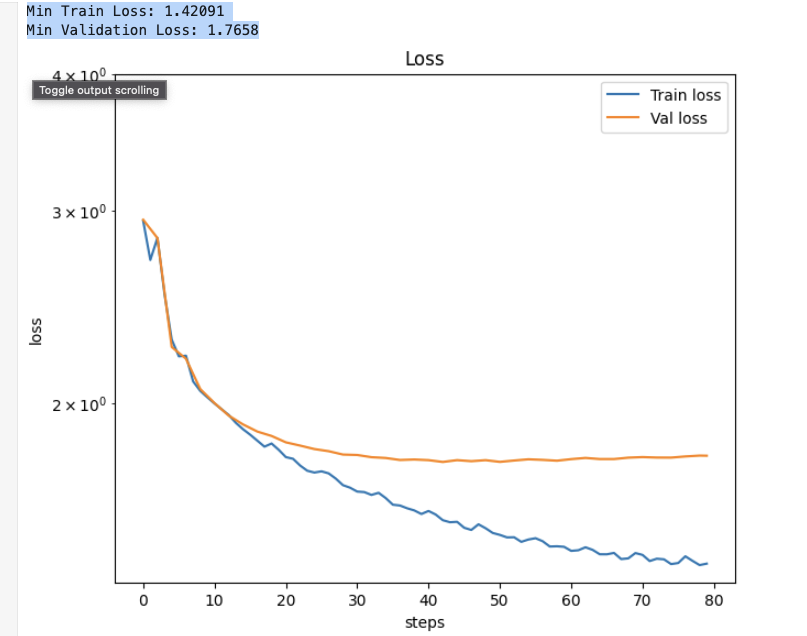

# GPT2 Instruct

Instruction Tuning GPT2 (124M) using [Alpaca Dataset](https://huggingface.co/datasets/tatsu-lab/alpaca).

## Intention
In this project, I re-train the GPT2 (124M) base model on the [Alpaca Dataset](https://huggingface.co/datasets/tatsu-lab/alpaca), to understand "Instruction Tuning of base-models to behave like Chat-bots."

## Process
1. Get the alpaca dataset.
2. Preprocess the dataset with "Instruction, Input, Output" template mentioned below and add `<|endoftext|>` special token after every example.
3. Load the pre-trained GPT2 (124M) model using weights from hugging-face
4. Run training for 10 epochs. (10 was chosen randomly. From the results it looks like validation-loss flattened after 40 steps.)
5. Evaluate the results

### Pre Processing Template

```
### Instruction:

### Input:

### Output:
```

## Results

- Min Train Loss: 1.42091
- Min Validation Loss: 1.7658



## Sample Generation

While the GPT2 base model keeps blabbering continuosly, the instruction-tuned model gives coherent answers.

```
Enter a prompt: What is 2 + 2?
2 + 2 is equivalent to 4.

Enter a prompt: Where is Eiffel Tower?
The Eiffel Tower is located in Paris, France.

Enter a prompt: Who is the president of U.S?
The president of the United States is Barack Obama.
```

more can be found in [infer.ipynb](infer.ipynb)

## TODO

- [ ] The current processing template (`### Instruction ...`) wastes lots of tokens. Instead use special tokens
- [ ] Pad the examples with pad_token and train instead of packing them all together
- [ ] Train on more instructions to see how far we can take GPT2
- [ ] Evaluate on any benchmark.


